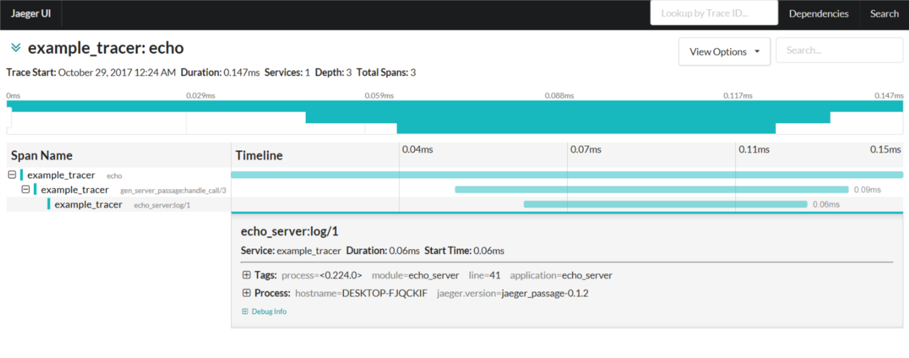

otp_passage
===========

[](https://hex.pm/packages/otp_passage)
[](https://travis-ci.org/sile/otp_passage)
[](https://codecov.io/gh/sile/otp_passage/branch/master)
[](LICENSE)

[OpenTracing](http://opentracing.io/) instrumentation library for the Erlang/OTP behaviours.

This uses [passage](https://github.com/sile/passage) as OpenTracing API library.

[Documentation](https://hexdocs.pm/otp_passage/)


A Running Example
-----------------

This example uses following simple echo server.


```erlang
-module(echo_server).

-compile({parse_transform, passage_transform}). % Enables `passage_trace` attribute

-behaviour(gen_server).

-export([start_link/0, echo/1]).
-export([init/1, handle_call/3, handle_cast/2, handle_info/2, terminate/2, code_change/3]).

%% Exported Functions
start_link() ->
    %% Uses `gen_server_passage` instead of `gen_server`
    gen_server_passage:start_link({local, ?MODULE}, ?MODULE, [], []).

echo(Message) ->
    %% Uses `gen_server_passage` instead of `gen_server`
    gen_server_passage:call(?MODULE, {echo, Message}).

%% `gen_server` Callbacks
init(_) -> {ok, []}.

handle_call({echo, Message}, _, State) ->
  log(Message),
  {reply, Message, State}.

handle_cast(_, State) -> {noreply, State}.
handle_info(_, State) -> {noreply, State}.
terminate(_, _) -> ok.
code_change(_, State, _) -> {ok, State}.

%% Internal Functions
-passage_trace([]). % Annotation for tracing.
log(Message) ->
  io:format("Received: ~p\n", [Message]),
  ok.
```

By using [jaeger](https://uber.github.io/jaeger/) and [jaeger_passage](https://github.com/sile/jaeger_passage), you can easily trace and visualize the behaviour of the above server.

As the first step, you need to start jaeger daemons.
```console
$ docker run -d -p6831:6831/udp -p6832:6832/udp -p16686:16686 jaegertracing/all-in-one:latest
```

Next, start Erlang shell and execute following commands.
```erlang
% Starts `example_tracer`
> Sampler = passage_sampler_all:new().
> ok = jaeger_passage:start_tracer(example_tracer, Sampler).

% Starts `echo_server`
> {ok, _} = echo_server:start_link().

% Traces an echo request
> passage_pd:with_span(echo, [{tracer, example_tracer}],
                       fun () -> echo_server:echo(hello) end).
```

You can see the tracing result by your favorite browser (in this example, firefox).
```console
$ firefox http://localhost:16686/
```


